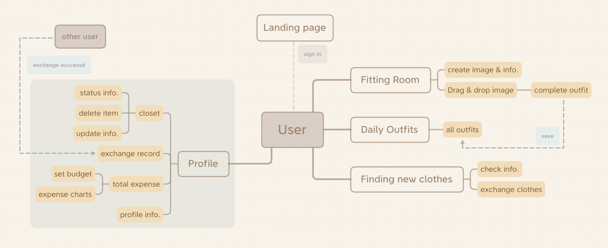
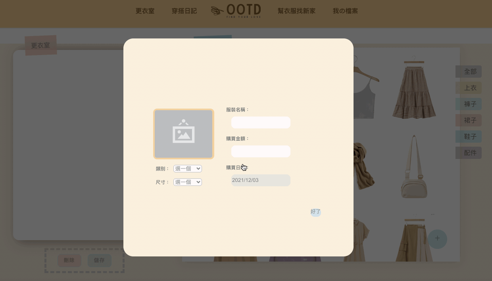
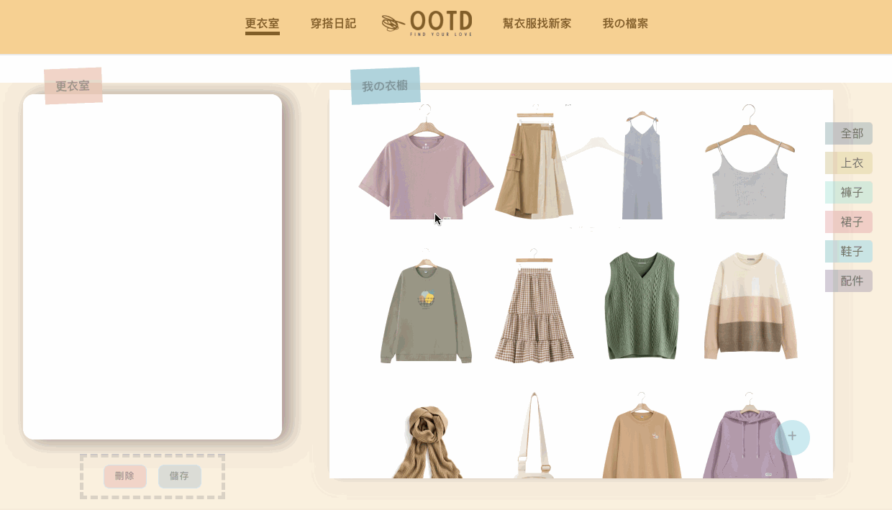

# OOTD- Outfit Of The Day

##  Website Link

- **Website Link :** https://side-project-d1344.web.app/

Use Google account to login  
You can also create your own native account  

- **Test Account** 
  account: test@test.com 
  password: test123

##  Techniques

### Front-End Fundamental

- Javascript (ES6)
- HTML
- CSS
<!-- - Responsive Web Design (RWD) -->

### Frameworks & Library

- React (Hooks)
- React Router
- Styled-Components
- Redux

### Firebase Service

- Authentication
- Cloud Firestore
- Cloud Storage
- Cloud Function
- Hosting

### Packages

- fabric
- recharts
- sweetalert2
- reactjs-popup
- react-loadingg
- react-icons
- react-fontawesome
- aos

### Other

- Lint Tool: ESLint with airbnb style
- Version Control : Git / GitHub
- Unit Test: Jest

##  Flow Chart

##  Features Demo

- Upload user's clothes in the closet
   

- Drag and drop image into canvas using fabric and save
   

- Fill in the infomation of exchange and check it on Find new dress page
   

##  Future Features

- Build Chat Room to let users connect with each other and make sure contact infomation before exchange clothes

##  Contact

**Author:** Joyce Weng  
**Email:** joyce820309@gmail.com
